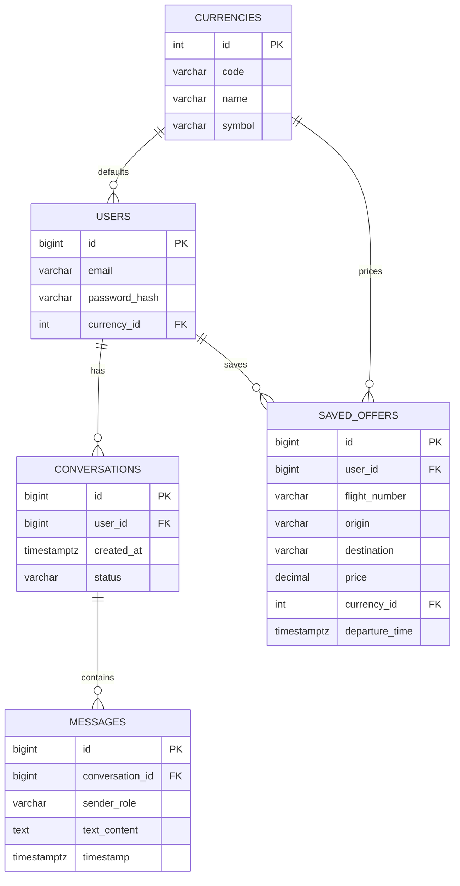

# PostgreSQL Database

This folder contains the PostgreSQL database layer for the application.

## Structure

- `code/`: Prisma schema, client, config, and seed runner.
- `migrations/`: Prisma migration history.
- `seeds/`: Seed data files (JSON).
- `database-erd.pdf`: Original ERD source file.

## ERD Mapping

- `currencies` 1-to-many `users`
- `currencies` 1-to-many `saved_offers`
- `users` 1-to-many `conversations`
- `conversations` 1-to-many `messages`
- `users` 1-to-many `saved_offers`

## Mermaid ERD

## Notes

- The authoritative ORM schema lives in `api/src/db/code/schema.prisma`.
- The shared Prisma client lives in `api/src/db/code/prisma.js`.
- The Prisma seed runner lives in `api/src/db/code/seed.js`.
- SQL migrations live in `api/src/db/migrations/`.
- Seed JSON files live in `api/src/db/seeds/`.
- Run `npm run db:seed` to execute all registered seeds.
- Use `DATABASE_URL` from `.env` to connect Prisma and PostgreSQL.

## Setup Commands

Use these commands in this order:

1. `npm run db:create`
2. `npm run db:validate`
3. `npm run db:migrate`
4. `npm run db:generate`
5. `npm run db:seed`

Or run everything in one command:

- `npm run db:all`
